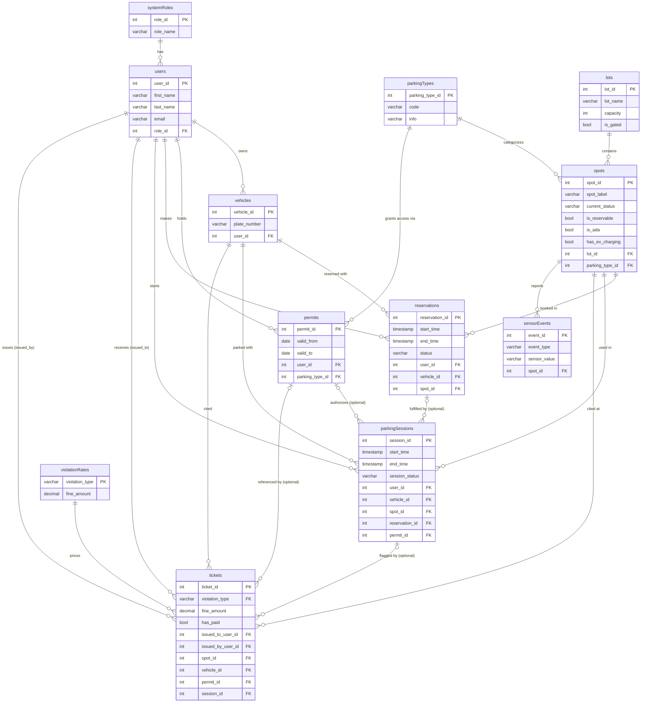
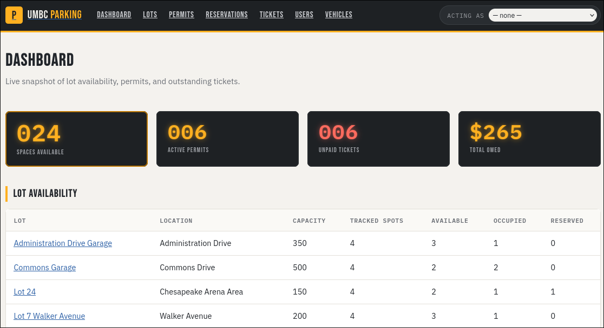
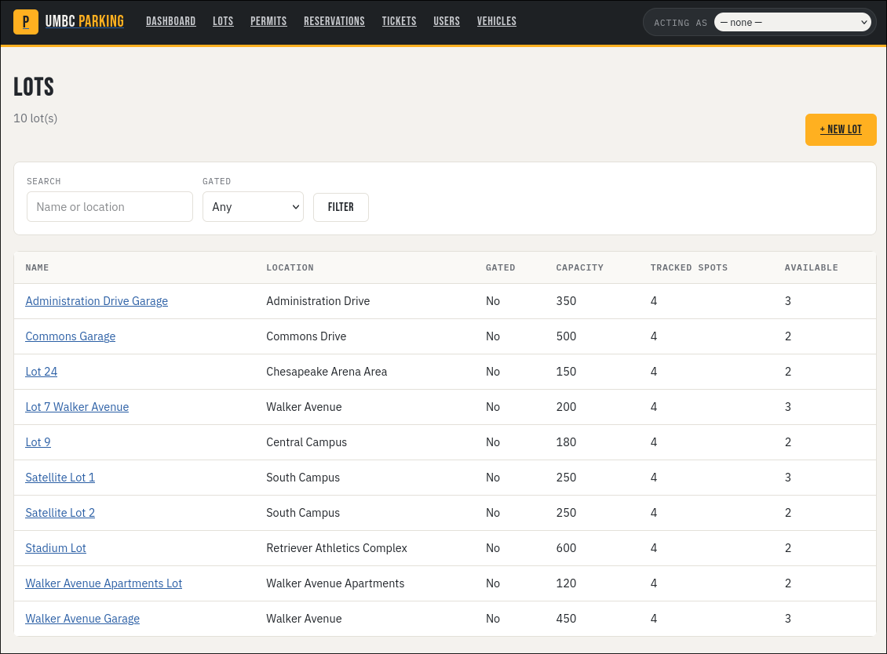
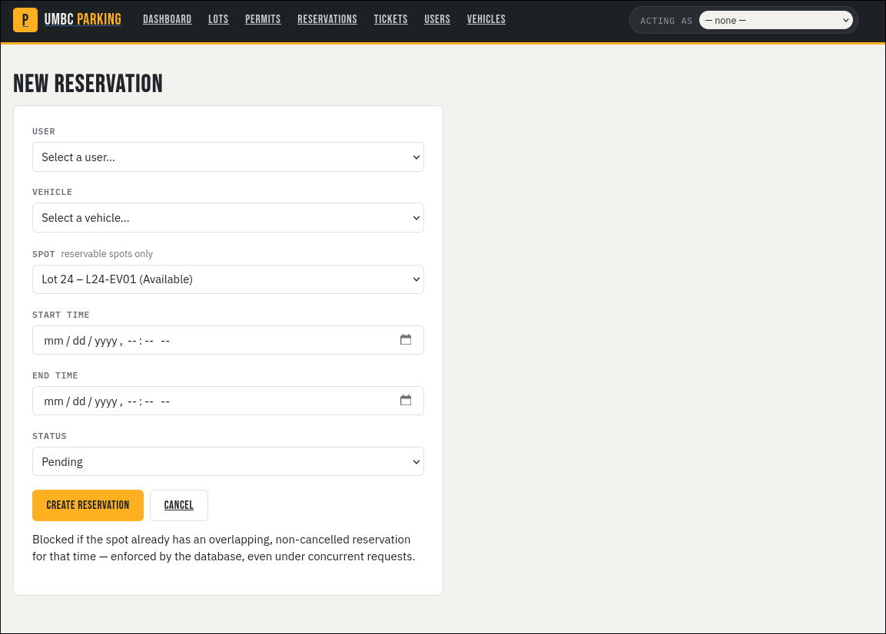

# UMBC-Parking-Management-System-Spring-2026-

## Overview

The UMBC Parking Management System is a full-stack, database-first web application for managing campus parking operations: users, roles, vehicles, permits, parking lots and spots, reservations, parking sessions, sensor events, and tickets.

The project's center of gravity is the PostgreSQL schema — normalized tables, foreign keys with explicit `ON DELETE` behavior, `CHECK` constraints, a `violationRates` lookup table, and business logic implemented as SQL functions/procedures/triggers (permit issuance, reservation creation and cancellation, automatic ticketing, spot-status bookkeeping from sensor events). Double-booking a spot is prevented at the database level by a Postgres `EXCLUDE` constraint, not application code — see [Concurrency test](#concurrency-test-double-booking-prevention) below.

A Flask web app sits on top of that schema and calls its functions/procedures directly rather than reimplementing their logic in Python.

> **Note:** The sample data in this repository (lot names, permit types, users, etc.) is illustrative and fictional. It is not sourced from or verified against UMBC's actual parking structure.

## Tech stack

| Layer | Choice |
|---|---|
| Database | PostgreSQL 16 |
| Backend | Python, Flask, SQLAlchemy Core (not the ORM — see below) |
| Frontend | Jinja2 server-rendered templates, hand-written CSS |
| WSGI server | Gunicorn |
| Containers | Docker Compose / Podman Compose |
| DB admin UI | pgAdmin 4 |

SQLAlchemy **Core** was used deliberately instead of the full ORM: the schema's actual business rules already live in the database (functions, procedures, constraints, triggers), so the app's job is to call that logic (`make_reservation()`, `cancel_reservation()`, `issue_permit()`, ...) through plain parameterized SQL, not to re-derive it as Python model methods.

## Features

- **Dashboard** — live lot availability, active permit count, unpaid ticket total, upcoming reservations.
- **Lots** — full CRUD, search/filter by name or gated status, per-lot spot listing.
- **Permits** — issue/revoke, filter by user/type/status (active/upcoming/expired). Blocked by the database if the same user already has an overlapping permit of that type, and by the app if the type's active-permit count has reached its lots' combined capacity.
- **Reservations** — create/cancel/delete, filter by status/lot. Double-booking is impossible even under concurrent requests (DB-level `EXCLUDE` constraint).
- **Tickets** — list/filter (all or unpaid-only), mark paid, issue a new ticket (fine amount auto-filled from the `violationRates` table). Issuing is gated to Enforcement Officer/Admin roles via the "act as" selector.
- **Users & Vehicles** — supporting CRUD needed to drive the above.
- **"Act as" selector** — a lightweight, no-password way to pick which existing user the UI acts as, so role-gated actions (like issuing a ticket) can be demonstrated without building full authentication.

## Schema overview



Business logic implemented directly in the database (`sql/createDDL.sql`):

* `issue_permit(user_id, parking_type_id, valid_from, valid_to)` — validates the user and parking type exist and that no overlapping permit of the same type already exists, then inserts.
* `make_reservation(start_time, end_time, status, user_id, vehicle_id, spot_id)` — validates the spot is reservable, then inserts. The `reservations_spot_id_tsrange_excl` `EXCLUDE` constraint on `reservations` is what actually guarantees no double-booking under concurrency; the function's own check is a fast-path for a clean error message.
* `cancel_reservation(reservation_id)` / `delete_reservation(reservation_id)` — cancel (keep the row, mark `Cancelled`) or delete a reservation and free the spot.
* `auto_ticket_violations(issued_by_user_id)` — scans `parkingSessions` and tickets sessions with no permit or an expired one, pricing each ticket from `violationRates`.
* `trg_sensor_update` trigger — keeps `spots.current_status` in sync with incoming `sensorEvents` rows.

## Quick start

Requires Docker Compose or Podman Compose. From the repository root:

```bash
cp .env.example .env
docker compose up -d      # or: podman compose up -d
```

That single command builds and starts everything:

1. `db` (PostgreSQL) starts.
2. `db-runner` waits for it, then runs `createDDL.sql` → `loadAll.sql` → `indexAll.sql` once (it's a no-op on subsequent restarts against an already-initialized volume — safe to re-run).
3. `web` waits for `db-runner` to finish, then starts.
4. `pgadmin` starts alongside `db`.

Once it's up:

* **Web app:** http://localhost:5000 (or your `WEB_PORT`)
* **pgAdmin:** http://localhost:5050 (or your `PGADMIN_PORT`) — see [Connecting with pgAdmin](#connecting-with-pgadmin)



| Lots | New reservation |
|---|---|
|  |  |

Check everything came up:

```bash
docker ps      # or: podman ps
```

You should see `umbc_parking_db`, `umbc_parking_pgadmin`, `umbc_parking_web` running, and `umbc_parking_db_runner` exited with status `0`.

Stop everything with `docker compose down` (data persists in the `postgres_data` volume) or `docker compose down -v` to also wipe the database and start fresh next time.

## Project structure

```text
UMBC-Parking-Management-System-Spring-2026-/
├── docker-compose.yml
├── Dockerfile              # builds the `web` service
├── requirements.txt
├── wsgi.py                 # Flask entrypoint (gunicorn wsgi:app)
├── .env.example
├── app/
│   ├── __init__.py         # Flask app factory, error handlers, "act as" selector
│   ├── db.py                # SQLAlchemy engine + helpers that call SQL functions/procedures
│   ├── routes/               # one blueprint per entity
│   │   ├── dashboard.py
│   │   ├── lots.py
│   │   ├── permits.py
│   │   ├── reservations.py
│   │   ├── tickets.py
│   │   ├── users.py
│   │   ├── vehicles.py
│   │   └── session_routes.py
│   ├── templates/            # Jinja2 templates, one folder per entity
│   └── static/style.css
├── runner/                  # one-shot DB bootstrap container (schema + seed data)
│   ├── Dockerfile
│   ├── requirements.txt
│   └── run_sql.py
└── sql/
    ├── createDDL.sql         # schema, constraints, functions/procedures, triggers, views
    ├── dropDDL.sql            # reverse of createDDL.sql, for a manual reset
    ├── loadAll.sql             # seed data
    ├── indexAll.sql             # performance indexes
    ├── queryAll.sql              # example reporting queries (manual use)
    ├── transaction.sql            # concurrency demo (manual use, see below)
    └── smoke_test.sql              # placeholder, currently empty
```

## Environment variables

| Variable | Meaning |
|---|---|
| `DB_NAME`, `DB_USER`, `DB_PASSWORD`, `DB_PORT` | PostgreSQL connection settings, shared by `db`, `db-runner`, and `web` |
| `PGADMIN_EMAIL`, `PGADMIN_PASSWORD`, `PGADMIN_PORT` | pgAdmin login and host port |
| `WEB_PORT` | Host port the Flask app is published on (default `5000`) |
| `FLASK_SECRET_KEY` | Signs the Flask session cookie (used only for flash messages and the "act as" selector — change it for any real deployment) |

## Concurrency test: double-booking prevention

`sql/transaction.sql` demonstrates that a spot can't be double-booked, even by two sessions running the exact naive "check for overlap, then insert" pattern with **no** manual locking (`SELECT ... FOR UPDATE`) — because the `reservations_spot_id_tsrange_excl` `EXCLUDE` constraint enforces it at the database level, the same way a `UNIQUE` constraint would.

To run it:

1. Bring the stack up (`docker compose up -d`) so the schema and seed data exist.
2. Connect with pgAdmin (see below) or `psql`, open the `umbc_parking` database.
3. Run the Section 0 setup block from `sql/transaction.sql`.
4. Open two Query Tool tabs. Copy the Section 2 Session 1 block into the first and run it; while it's inside `pg_sleep(15)`, copy the Section 2 Session 2 block into the second tab and run it.
5. Run the Section 2 verify block — it shows exactly **one** reservation, never two.

`transaction.sql` also has a Section 1 baseline (a single session inserting two overlapping reservations, rejected immediately) and a Section 3 test showing the same protection through `make_reservation()`, where the losing call gets the friendly `Spot already reserved for that time` error instead of a raw Postgres exception.

## Manual SQL usage (advanced / reference)

The `docker compose up -d` quick start already runs `createDDL.sql` → `loadAll.sql` → `indexAll.sql` for you. The commands below are for resetting the database by hand, running the example report queries, or exploring the schema directly — useful when iterating on the SQL itself.

Find your container names if they differ from the examples below:

```bash
docker ps --format "{{.Names}}"      # or: podman ps --format "{{.Names}}"
```

Reset and rebuild the schema + data by hand, in order:

```bash
docker exec -i -e PGPASSWORD=password umbc_parking_db psql -v ON_ERROR_STOP=1 -U admin -d umbc_parking < sql/dropDDL.sql
docker exec -i -e PGPASSWORD=password umbc_parking_db psql -v ON_ERROR_STOP=1 -U admin -d umbc_parking < sql/createDDL.sql
docker exec -i -e PGPASSWORD=password umbc_parking_db psql -v ON_ERROR_STOP=1 -U admin -d umbc_parking < sql/loadAll.sql
docker exec -i -e PGPASSWORD=password umbc_parking_db psql -v ON_ERROR_STOP=1 -U admin -d umbc_parking < sql/indexAll.sql
```

(Swap `docker exec` for `podman exec` if you're using Podman.)

Run the example report queries:

```bash
docker exec -i -e PGPASSWORD=password umbc_parking_db psql -v ON_ERROR_STOP=1 -U admin -d umbc_parking < sql/queryAll.sql
```

Verify the data loaded correctly:

```bash
docker exec -it -e PGPASSWORD=password umbc_parking_db psql -U admin -d umbc_parking
```

```sql
\dt public.*

SELECT 'users' AS table_name, COUNT(*) AS row_count FROM public.users
UNION ALL SELECT 'vehicles', COUNT(*) FROM public.vehicles
UNION ALL SELECT 'parkingtypes', COUNT(*) FROM public.parkingtypes
UNION ALL SELECT 'lots', COUNT(*) FROM public.lots
UNION ALL SELECT 'spots', COUNT(*) FROM public.spots
UNION ALL SELECT 'permits', COUNT(*) FROM public.permits
UNION ALL SELECT 'reservations', COUNT(*) FROM public.reservations
UNION ALL SELECT 'parkingsessions', COUNT(*) FROM public.parkingsessions
UNION ALL SELECT 'tickets', COUNT(*) FROM public.tickets
UNION ALL SELECT 'violationrates', COUNT(*) FROM public.violationrates
UNION ALL SELECT 'sensorevents', COUNT(*) FROM public.sensorevents;
```

## Connecting with pgAdmin

Open `http://localhost:5050` (or your `PGADMIN_PORT`) and log in with `PGADMIN_EMAIL` / `PGADMIN_PASSWORD`.

Register a new server:

* **General → Name:** `UMBC Parking DB`
* **Connection → Host name/address:** `db` (the Compose service name — pgAdmin reaches Postgres over the internal Compose network, not `localhost`)
* **Connection → Port:** `5432`
* **Connection → Maintenance database:** value of `DB_NAME`
* **Connection → Username / Password:** values of `DB_USER` / `DB_PASSWORD`

From there: **Servers → UMBC Parking DB → Databases → `umbc_parking` → Schemas → public → Tables** to browse the schema, or right-click the database and choose **Query Tool** to run SQL directly.

## Connecting with `psql` directly

```bash
psql -h localhost -p 5432 -U admin -d umbc_parking
```

Use the values of `DB_PORT`, `DB_USER`, `DB_NAME`, `DB_PASSWORD` from your `.env` if you changed them.

## Stopping or resetting containers

```bash
docker compose down        # stop; postgres_data volume (your data) persists
docker compose down -v     # stop AND delete the postgres_data volume -- next `up` starts fully fresh
```
(Swap `docker compose` for `podman compose` if you're using Podman.)
